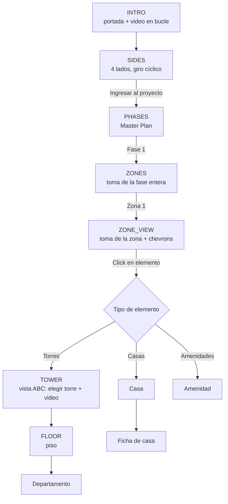

# Navegación y reglas de desplazamiento

Toda la lógica descrita aquí está implementada como funciones puras en
`src/data/urbanization/navigation.ts`. La UI solo pinta lo que esas funciones
devuelven; no decide.

---

## 1. Flujo completo



El paso en el que está el usuario se etiqueta con `NavigationStep`, que además
**es** la máquina de estados del showroom (`src/app/showroom/page.tsx`): el paso
que ve el visitante y el que se registra en analíticas son el mismo valor.

**La vuelta atrás recorre ese mismo encadenamiento al revés, sin atajos**: de la
zona se vuelve a la fase, de la fase al Master Plan, y del Master Plan al giro
360. El Master Plan es el centro del recorrido; el giro 360 cuelga de él.

> Antes la toma con todas las fases era un modo escondido dentro del paso de
> los lados (`showFasesOverview`). Volver desde una fase remontaba ese paso en
> su estado inicial, así que el visitante aterrizaba en el giro 360 y se
> saltaba el Master Plan y la fase enteros. Por eso ahora es un paso propio.

---

## 2. Intro

Igual que en Océano Atlántico: una imagen de portada con el logo y el texto de
presentación; al avanzar, la imagen se desplaza y da paso a las tomas aéreas
(los lados), desde donde se puede "ingresar" al proyecto.

---

## 3. Lados — giro **cíclico**

Esta es la diferencia de fondo con Océano, donde había 3 caras y el giro se
bloqueaba al llegar al extremo.

- Los lados se recorren en el orden declarado en `sidesOrder`.
- Del **último a la derecha se vuelve al primero**, y del primero a la izquierda
  se salta al último: **siempre** hay flecha izquierda y flecha derecha.
- El ciclo se calcula con módulo sobre la longitud de la lista, así que agregar
  un quinto lado o quitar uno no toca la lógica.

```ts
getNeighborSide(sides, SideId.SIDE_4, LateralDirection.RIGHT) // → SIDE_1
getNeighborSide(sides, SideId.SIDE_1, LateralDirection.LEFT)  // → SIDE_4
```

Desde cualquier lado se puede **ingresar** al proyecto (video `enterVideo`), lo
que lleva a la vista de fases.

---

## 4. Master Plan y fases

Se muestra la toma aérea con toda la urbanización — el **Master Plan**. Solo
las fases con `status = AVAILABLE` son clicables; las demás se pintan borrosas
con el rótulo "Próximamente". Hoy: Fase 1 disponible, Fases 2, 3 y 4
próximamente.

Pulsar una fase **no** lleva directo a una zona: lleva a la toma de la fase
entera, donde cada zona tiene su rótulo. Es un escalón propio, para que el
visitante vea la fase completa y entienda dónde cae la zona en la que va a
aterrizar.

Cuando lleguen las tomas de las Fases 2, 3 y 4, se cambia su `status` y se les
cuelgan sus zonas: **usan exactamente la misma mecánica de desplazamiento y
exposición que la Fase 1**, sin código nuevo.

---

## 5. Zonas — desplazamiento con chevrons

Cada zona es una **cuadrícula de vistas**. Cada vista es una imagen a pantalla
completa; moverse arriba/abajo/izquierda/derecha cambia de vista.

Fase 1, tal como llegaron los archivos (2×2)… menos la Zona 4, que **no entra
en esta etapa** y por eso no se declara: hoy la cuadrícula es una L de tres
celdas.

```
             col 0                col 1
        ┌──────────────────┬──────────────────┐
fila 0  │  Zona 1          │  Zona 3          │
        │  ZONA 1.jpg      │  ZONA 3.jpg      │
        ├──────────────────┼──────────────────┘
fila 1  │  Zona 2          │   (Zona 4 fuera de esta etapa)
        │  ZONA 2.jpg      │
        └──────────────────┘
```

El reparto sale de comparar cada toma con recortes de `FASE 1.jpg`, no del
nombre de los archivos: ver `docs/02-ASSETS.md` §1.

Bloquear la Zona 4 no necesitó ni una comprobación en la UI ni un cartel de
"Próximamente": al no estar declarada, no es vecina de nadie y el chevron que
llevaba a ella **desaparece solo** — desde la Zona 3 ya no hay flecha abajo, y
desde la Zona 2 ya no hay flecha derecha. El teclado queda bloqueado por lo
mismo. Sumarla en la siguiente etapa es sacarla de `ZONES_NOT_IN_THIS_STAGE`
(`zones.ts`); su toma ya está subida.

Reglas:

- **Los chevrons no se declaran, se deducen.** `getAvailableDirections()`
  devuelve solo las direcciones que tienen vecino; la UI pinta una flecha por
  cada una. En la Zona 1 aparecen ↓ y →; en la Zona 2, solo ↑; en la Zona 3,
  solo ←.
- **El desplazamiento en la zona NO es cíclico** (a diferencia de los lados):
  al llegar al borde, ese chevron simplemente no existe.
- La cuadrícula es dato: una zona 3×3, 1×4 o con forma de L funciona sin tocar
  el componente. Basta declarar sus vistas con su `row`/`col`.
- Opcionalmente, cada vista puede declarar `panVideos` para animar el
  desplazamiento; si no existe el video, la transición es un fundido.

---

## 6. Elementos de la zona

Dentro de una vista hay **elementos** clicables (manzanas). Cada elemento
declara sus `hotspots` **por vista**, porque una misma manzana puede verse en
dos celdas contiguas de la cuadrícula.

La geometría usa la misma convención que las plantas de Océano: `x`/`y` en
porcentaje 0–100 y `path` como atributo `d` de SVG en espacio 0–100.
Para trazar y remarcar las coordenadas de cualquier pantalla (Fases, Zonas,
Manzanas, Torres o Unidades), el showroom integra el botón **"Marcar Coordenadas"**
(`ShowroomCoordinateTool`), que permite hacer clic directamente sobre el lienzo,
ajustar vértices por arrastre y copiar paths/hotspots en un solo clic.

La **manzana de los tres edificios está en la Zona 3**: la plataforma con los
tres bloques, su franja de jardineras y el estacionamiento arbolado. Se pinta
como polígono clicable —se resalta al pasar por encima— con el rótulo "Torres
A, B y C" centrado; de ahí se pasa a la toma `ABC` (§7.1). La manzana asoma
también por la esquina inferior derecha de la Zona 1, pero cortada, y por eso
no se recorta ahí.

Al pulsar un elemento, el destino depende de `contents`:

| Contenido | Destino |
|---|---|
| Solo torres | Torre de entrada (A) |
| Solo casas | Listado / ficha de casas del elemento |
| Casas + amenidades | Vista del elemento con ambas capas |

---

## 7. Torres — salto lateral que **conserva el piso**

Las tres torres están una al lado de la otra, así que el recorrido es lateral y
**no cíclico**:

| Torre | Flecha izquierda | Flecha derecha |
|---|---|---|
| A | — | → B |
| B | ← A | → C |
| C | ← B | — |

La regla central:

> Si el usuario está en el **piso 3 de la Torre A** y se mueve a la B, debe
> quedar en el **piso 3 de la Torre B**.

```ts
resolveTowerSwitch(towers, TowerId.TOWER_A, 3, LateralDirection.RIGHT)
// → { tower: Torre B, floor: piso 3 de la Torre B }
```

Si las torres tuvieran distinta altura y el piso no existiera en el destino,
`findEquivalentFloor()` cae al piso **más cercano** en vez de dejar la vista
vacía. Dentro de la torre, el recorrido vertical entre pisos es el mismo que el
de las plantas de Océano Atlántico: hoy, 6 pisos por torre.

### 7.0 Los departamentos de la planta

Cada planta son dos bloques con la escalera en medio, y cada bloque se parte en
dos departamentos: **cuatro por piso, iguales en todos los pisos**… salvo la de
arriba del todo. La numeración es la que marcó el cliente sobre el render:

```
        ┌───────────────┬───────────────┐
        │       4       │       3       │   fondo
        ├───────────────┼───────────────┤
        │       1       │       2       │   frente
        └───────────────┴───────────────┘
           bloque izq.     bloque der.
```

**La planta 6 es la azotea**: no tiene departamentos, solo la terraza y las
escaleras (se ve en `A6`, `B6` y `C6`). Se recorre como una más —tiene su toma
y su sitio en el selector, y se rotula "Terraza" en vez de "Piso 6"— pero no
genera unidades ni recortes clicables.

El **código comercial** es piso + número a dos cifras: el 1 del piso 1 es el
`101`; el 3 del piso 5, el `503`. Con 3 torres × 5 plantas con departamentos ×
4 son **60 unidades**, todas generadas desde `UNIT_SLOTS` en `towers.ts` — no
hay 60 declaraciones a mano.

Que la azotea sea la de arriba no está escrito como "el piso 6 es especial":
`TERRACE_LEVEL` se deriva de `FLOORS_PER_TOWER`, así que si la torre crece un
piso, la azotea sigue siendo la de arriba sin tocar nada.

El código no lleva la letra de la torre porque las tres numeran igual y la
torre ya está a la vista en la cabecera ("Torre A · Piso 5"). Si el cliente
prefiere `A-101`, se cambia en `buildUnitIdentifier()` y cambian las 72 a la
vez.

Los recortes clicables se midieron sobre las propias imágenes (perfil de
luminosidad de los muros, no a ojo) y son los mismos para las 60 unidades: se
comprobó que las seis plantas de una torre —y las tres torres entre sí—
comparten encuadre y distribución exactos. La diferencia entre `A1` y `A5`, o
entre `A1` y `B1`, está toda fuera del edificio: vegetación y vecinos.

> **PENDIENTE**: la ficha de la unidad. Hoy al pulsar un departamento se
> resalta y se muestra su código; el detalle (área, dormitorios, baños, precio,
> galería) espera al inventario. Ese click es el punto donde engancha la página
> de detalle.

### 7.1 Entrar a una torre ≠ pasar de una torre a otra

Son dos movimientos distintos y conviene no mezclarlos:

| | Desde la toma de las tres (`ABC`) | De una torre a la de al lado |
|---|---|---|
| Función | `resolveTowerEntry(tower)` | `resolveTowerSwitch(towers, id, piso, sentido)` |
| Video | Sí: `entry.mp4` de esa torre | No (fundido) |
| Piso al llegar | `entryLevel` — el piso en el que **termina** el video (hoy, el 5) | **El mismo** en el que estaba |

Es decir: se entra a la Torre A por el piso 5 porque ahí acaba la animación,
pero si el visitante baja al piso 3 y se pasa a la Torre B, aparece en el piso
3 de la B. No vuelve al 5 ni se reproduce ningún video.

El truco de que no se note el corte es que el **último fotograma del video es
exactamente la planta** que se muestra después, así que las plantas de
aterrizaje de las tres torres se precargan antes de que el visitante elija.
Como red de seguridad, si el navegador suspende el video cerca del final
—Chrome lo hace "para ahorrar energía" y entonces el evento `ended` no llega
nunca— la vista entra igual en lugar de quedarse en un fotograma congelado.

---

## 8. Pestaña Amenidades

Ya no abre directo en la galería. Ahora presenta **tres tarjetas verticales**,
una por fase:

```
┌────────┐  ┌────────┐  ┌────────┐
│        │  │ ░░░░░░ │  │ ░░░░░░ │
│ FASE 1 │  │ ░FASE2░│  │ ░FASE3░│
│        │  │ Próxi- │  │ Próxi- │
│ nítida │  │ mamente│  │ mamente│
└────────┘  └────────┘  └────────┘
  clicable    borrosa     borrosa
```

El borroso y el rótulo salen de `PhaseStatus`, no de una lista aparte: cuando
la Fase 2 pase a `AVAILABLE` en `phases.ts`, su tarjeta se vuelve nítida y
clicable sola. Las tarjetas se generan en `amenities-tab.ts`.
