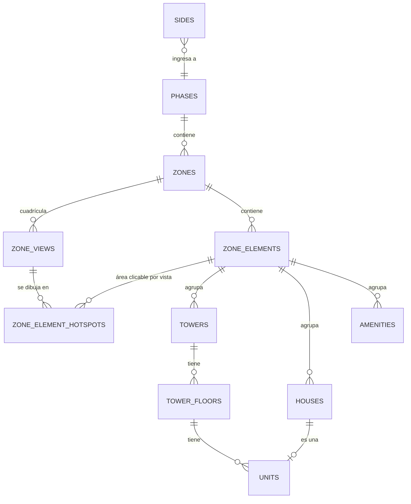

# Dónde vive el inmueble: código o base de datos

> **Estado: decidido.** Este documento empezó como propuesta de migrar toda la
> urbanización a D1. La decisión fue la contraria y está tomada: **la estructura
> se queda en código y en D1 vive solo lo que cambia solo.** Lo que sigue es la
> frontera, el porqué, y el esquema que se propuso —conservado como referencia
> por si algún día un proyecto justifica cruzarla.

## 0. La decisión

| Qué | Dónde vive | Por qué |
|---|---|---|
| Fases, zonas, cuadrícula, manzanas, torres, pisos | `src/data/urbanization/` | Es geometría atada a las imágenes |
| Polígonos (`path`), hotspots, coordenadas | `src/data/urbanization/` | Se trazan con `PathBuilder` sobre una toma concreta |
| Etiquetas visibles | `enums.ts`, catálogos `*Label` | Cambian a menudo, pero las cambia quien despliega |
| Estado comercial, comprador, área, galería por unidad | D1, tabla `units` | Lo edita el cliente a diario desde el panel |
| Citas, prospectos, media, brochures, tours, POIs, logs | D1 | Igual: contenido vivo |

La razón de fondo: **la estructura no puede cambiar sin un despliegue de todos
modos.** Una manzana nueva llega junto con su render, su recorte y su polígono;
subir la toma a R2 y trazar el polígono ya obliga a pasar por el repositorio. Una
tabla `zones` en D1 no ahorraría ese paso, y a cambio partiría en dos la fuente de
verdad de la geometría.

Lo que sí edita el cliente todos los días —marcar un lote como vendido, poner el
nombre del comprador, corregir un área— ya está en D1.

## 1. Cómo se juntan las dos mitades

`getUrbanizationUnitsData()` (`src/app/actions/units.ts`) es la costura: recorre
el catálogo declarado en `src/data/urbanization/` y le superpone la fila de
`units` cuando existe. La fila se crea **sola, la primera vez que alguien cambia
algo** desde el panel (`updateUrbanizationUnitState`), así que la base no
arranca con 193 filas muertas: solo guarda las unidades que se apartaron del
valor por defecto.

Por eso `units.floor_id` **no es una clave foránea**. Ahí caben ids de tres
sistemas distintos (`floor_1`, `mz-o`, `tower-a:floor-3`) y solo el primero
existe como fila en `floors`.

## 2. Lo que falta para cerrar la frontera

- ~~El panel todavía nombra las zonas en su UI.~~ **Hecho.** `UnitsDashboard`
  deriva las pestañas de `getUrbanizationZoneTabs()` y los selectores de
  manzana, torre, piso y tipología del propio inventario, con sus conteos
  reales. Los filtros salen según lo que la zona **contiene** (`kind`), no
  según qué zona es, así que una zona mixta pinta los dos juegos.
- **`ZoneInventoryNote`** (en `enums.ts`) es el matiz que distingue las zonas en
  el inventario. Al añadir una zona con producto vendible, va ahí.

---

# Anexo: el esquema que se propuso

Lo que sigue es el diseño completo de tablas por si un proyecto futuro necesita
que el cliente edite la estructura desde el panel. **No está implementado ni hay
migración**; se conserva porque el trabajo de modelado ya estaba hecho.

## 1. Qué se reemplaza

| Océano Atlántico | Olimpo Tumbes |
|---|---|
| `building_faces` (3 caras) | `sides` (4 lados, cíclico) |
| `floors` (pisos del edificio) | `tower_floors` (pisos **por torre**) |
| `units` (departamentos) | `units` ampliada: departamento **o** casa |
| — | `phases`, `zones`, `zone_views`, `zone_elements`, `zone_element_hotspots`, `towers`, `houses`, `amenities` |

---

## 2. Diagrama



---

## 3. Cómo se guardan los enums

En SQLite/D1 no hay tipo `ENUM`. La convención del proyecto:

1. La columna es `TEXT` y guarda **el valor del enum de TypeScript**
   (`'phase-1'`, `'tower-a'`, `'coming_soon'`…). Drizzle lo tipa con
   `text('status', { enum: [...] })`, así el compilador rechaza valores fuera
   del conjunto.
2. Se agrega un `CHECK` en la migración para que la BD también lo garantice.
3. **El texto visible NO se guarda en esa columna.** Va en `terminology_labels`
   (§5), editable desde el dashboard.

Así, renombrar "Lado 1" a "Lado Norte" es un `UPDATE` de una fila de etiquetas:
ni una fila de datos ni una clave foránea se mueve.

---

## 4. Tablas nuevas

```ts
// Lados de la urbanización. El id ES el valor del enum SideId.
sides = {
  id: text PK,                 // 'side-1' … 'side-4'
  order: integer NOT NULL,     // define el ciclo del giro
  label_override: text,        // opcional; si es null se usa terminology_labels
  day_background: text,
  day_background_video: text,
  day_enter_video: text,
  day_to_left_transition: text,
  day_to_right_transition: text,
  night_background: text,
  night_background_video: text,
  night_enter_video: text,
  night_to_left_transition: text,
  night_to_right_transition: text,
  day_to_night_transition: text,
  night_to_day_transition: text,
  ...timestamps
}

// Fases del proyecto.
phases = {
  id: text PK,                 // 'phase-1' … 'phase-3'
  order: integer NOT NULL,
  status: text NOT NULL,       // PhaseStatus: 'available' | 'coming_soon'
  image: text,                 // toma aérea de la fase
  thumbnail: text,             // usada en la portada de Amenidades
  coming_soon_note: text,
  ...timestamps
}

// Zonas dentro de una fase.
zones = {
  id: text PK,                 // 'zone-1' … 'zone-4'  (único por fase: ver nota)
  phase_id: text FK → phases.id NOT NULL,
  order: integer NOT NULL,
  status: text NOT NULL,       // PhaseStatus
  grid_rows: integer NOT NULL,
  grid_cols: integer NOT NULL,
  entry_row: integer NOT NULL, // celda por la que se entra
  entry_col: integer NOT NULL,
  ...timestamps
}

// Cada celda de la cuadrícula = una imagen a pantalla completa.
zone_views = {
  id: text PK,                 // 'zone-1:0-1'  (zona + fila-columna)
  zone_id: text FK → zones.id NOT NULL,
  row: integer NOT NULL,
  col: integer NOT NULL,
  slot: text,                  // ViewSlot: 'top-left' … (solo alias legible)
  image: text NOT NULL,
  pan_video_up: text,          // opcionales: video de desplazamiento
  pan_video_down: text,
  pan_video_left: text,
  pan_video_right: text,
  UNIQUE(zone_id, row, col),
  ...timestamps
}

// Manzana clicable dentro de una zona.
zone_elements = {
  id: text PK,
  zone_id: text FK → zones.id NOT NULL,
  label: text NOT NULL,
  kind: text NOT NULL,         // ZoneElementKind
  contents: text JSON NOT NULL,// ProductKind[]: ['house','amenity']
  ...timestamps
}

// Área clicable de un elemento EN UNA VISTA concreta.
// Tabla aparte porque un mismo elemento se ve en varias celdas de la cuadrícula.
zone_element_hotspots = {
  id: text PK,
  element_id: text FK → zone_elements.id NOT NULL,
  view_id: text FK → zone_views.id NOT NULL,
  x: real NOT NULL,            // 0–100
  y: real NOT NULL,            // 0–100
  path: text,                  // atributo `d` de SVG, espacio 0–100
  UNIQUE(element_id, view_id)
}

// Torres. El id ES el valor del enum TowerId.
towers = {
  id: text PK,                 // 'tower-a' | 'tower-b' | 'tower-c'
  zone_id: text FK → zones.id NOT NULL,
  element_id: text FK → zone_elements.id NOT NULL,
  order: integer NOT NULL,     // 0 = la de más a la izquierda
  label_override: text,
  facade_image: text,
  ...timestamps
}

// Pisos de una torre. Reemplaza a la tabla `floors` de Océano.
tower_floors = {
  id: text PK,                 // 'tower-a:floor-3'
  tower_id: text FK → towers.id NOT NULL,
  level: integer NOT NULL,     // número real: es lo que se conserva al saltar de torre
  label: text NOT NULL,        // lo que se muestra ('3', 'PH', 'PB')
  plan_image: text,
  UNIQUE(tower_id, level),
  ...timestamps
}

// Casas.
houses = {
  id: text PK,
  zone_id: text FK → zones.id NOT NULL,
  element_id: text FK → zone_elements.id NOT NULL,
  code: text NOT NULL,         // 'Mz. A Lt. 01'
  typology: text,
  status: text NOT NULL,       // UnitStatus
  bedrooms: integer,
  bathrooms: real,
  built_area_sqm: real,
  lot_area_sqm: real,
  plan_image: text,
  gallery: text JSON,
  tour_url: text,
  ...timestamps
}

// Amenidades.
amenities = {
  id: text PK,
  zone_id: text FK → zones.id,
  element_id: text FK → zone_elements.id,
  label: text NOT NULL,
  description: text,
  gallery: text JSON,
  tour_url: text,
  ...timestamps
}
```

> **Nota sobre `zones.id`.** Si las 4 zonas se repiten en cada fase, `zone-1`
> deja de ser único al llegar la Fase 2. Dos opciones: (a) clave compuesta
> `phase-1:zone-1` como `id`, o (b) `id` autogenerado + `UNIQUE(phase_id, zone_key)`.
> **Recomendación: (a)**, porque la clave sigue siendo legible en URLs y logs.
> Hay que decidirlo antes de generar la migración.

---

## 5. Tabla de etiquetas editables

```ts
terminology_labels = {
  id: text PK,
  entity_type: text NOT NULL,  // 'side' | 'phase' | 'zone' | 'tower' | 'unit_status' | …
  entity_key: text NOT NULL,   // 'side-1', 'phase-2', 'tower-a', 'sold' …
  label: text NOT NULL,        // 'Lado Norte'
  updated_at: integer,
  UNIQUE(entity_type, entity_key)
}
```

Resolución del texto visible, en este orden:

1. `label_override` de la fila (si la entidad lo tiene),
2. `terminology_labels`,
3. el catálogo por defecto del código (`SideLabel`, `PhaseLabel`, `TowerLabel`…).

Esto es lo que permite que el cliente cambie "Lado 1" por "Lado Norte" desde el
dashboard, sin despliegue.

---

## 6. Cambios en `units`

La tabla existente se amplía para cubrir departamentos **y** casas:

```ts
units = {
  id, identifier, …          // se conservan
  kind: text NOT NULL,       // UnitKind: 'apartment' | 'house' | 'storage'
  status: text NOT NULL,     // UnitStatus (hoy la columna se llama `state`)
  floor_id: text FK → tower_floors.id,   // si kind = 'apartment'
  tower_id: text FK → towers.id,         // desnormalizado, para filtrar rápido
  element_id: text FK → zone_elements.id,// si kind = 'house'
  house_id: text FK → houses.id,         // si kind = 'house'
  ...resto igual (coordenadas, galerías, tour_url…)
}
```

`floor_id` deja de apuntar a `floors` y pasa a apuntar a `tower_floors`.

---

## 7. Orden sugerido de trabajo

1. Cerrar las decisiones abiertas de `04-PENDIENTES.md` (sobre todo la clave de
   `zones` y el número de pisos por torre).
2. Escribir las tablas en `src/lib/db/schema.ts`.
3. `npm run db:generate` para la migración de Drizzle.
4. Aplicar **en local** (`npm run db:migrate`) y sembrar en local.
   ⚠️ `--remote` escribe sobre producción: nunca sembrar contra `--remote`.
5. Recién entonces conectar el dashboard.
